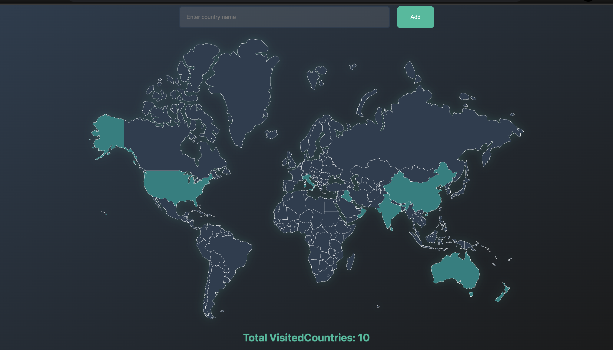

# 🌍 Visited Countries Tracker

A sleek and modern web application to track countries you've visited. Users can enter country names, and the app validates them against a real dataset and stores them in a PostgreSQL database. A dynamic SVG world map lights up with your visited countries, and a total count is displayed.

---

## 🚀 Features

- ✅ Enter a country name and mark it as visited
- 🎯 Validates country names using a real CSV dataset
- 📦 Stores visited countries in a PostgreSQL database
- 🌐 Visually displays visited countries on an interactive SVG map
- 📊 Shows the total number of visited countries
- ✨ Beautiful UI with smooth animations and responsive design
- 🔔 Popup notifications for success, duplication, or errors

---

## 🧠 Tech Stack & Your Skills

This project reflects your current skill set and learning path:

| Tech                | Description                                 |
|---------------------|---------------------------------------------|
| **Node.js**         | Backend runtime                             |
| **Express.js**      | Server framework                            |
| **PostgreSQL**      | Relational database                         |
| **EJS**             | Templating engine                           |
| **Body-Parser**     | Form data parsing                           |
| **dotenv**          | Environment variable management             |
| **CSV-parser**      | Reads and parses CSV data                   |
| **JavaScript (ES6+)**| Logic handling and DOM manipulation         |

---

## ⚙️ Setup Instructions

1. **Clone the repo:**

```bash
git clone https://github.com/yourusername/visited-countries-tracker.git
cd visited-countries-tracker
```

2. **Install dependencies:**
```bash
npm install
```

3. **Setup environment variables:**
Create a .env file in the root directory and fill in your PostgreSQL credentials:

``` env
PG_USER=your_user |
PG_HOST=localhost |
PG_DATABASE=your_db |
PG_PASSWORD=your_password |
PG_PORT=5432
```

4. **Create your PostgreSQL tables:**
``` sql
CREATE TABLE countries (
  id SERIAL PRIMARY KEY,
  country_code VARCHAR(2) NOT NULL UNIQUE,
  country_name VARCHAR(100)
);

CREATE TABLE visited_countries (
  id SERIAL PRIMARY KEY,
  country_code VARCHAR(2) NOT NULL UNIQUE,
  country_name VARCHAR(100)
);
```

5. **Import country data from CSV (run once):**
Uncomment and run the CSV import section in index.js, then comment it back after it's done.

6. **Run the server:**
```bash
npm start
```
Visit http://localhost:3000

## 🧪 Example Use Cases
 - Type "Sri Lanka", hit Add, and see it pop up on the map.
 - Try adding it again — you'll get a duplication message.
 - Enter "Randomland" — you’ll see an error saying it’s not found.

## 🛠️ Future Improvements

- 🎨 Theme Switcher: Light and dark mode toggle for a more personalized UX.
- 🔒 Authentication & Sessions:
    - Allow users to sign in and track their own visited countries.
    - Keep sessions to maintain user state.
- 🧹 Remove Mistaken Entries:
    - Allow users to delete a country if it was entered by mistake.


## Screenshots
